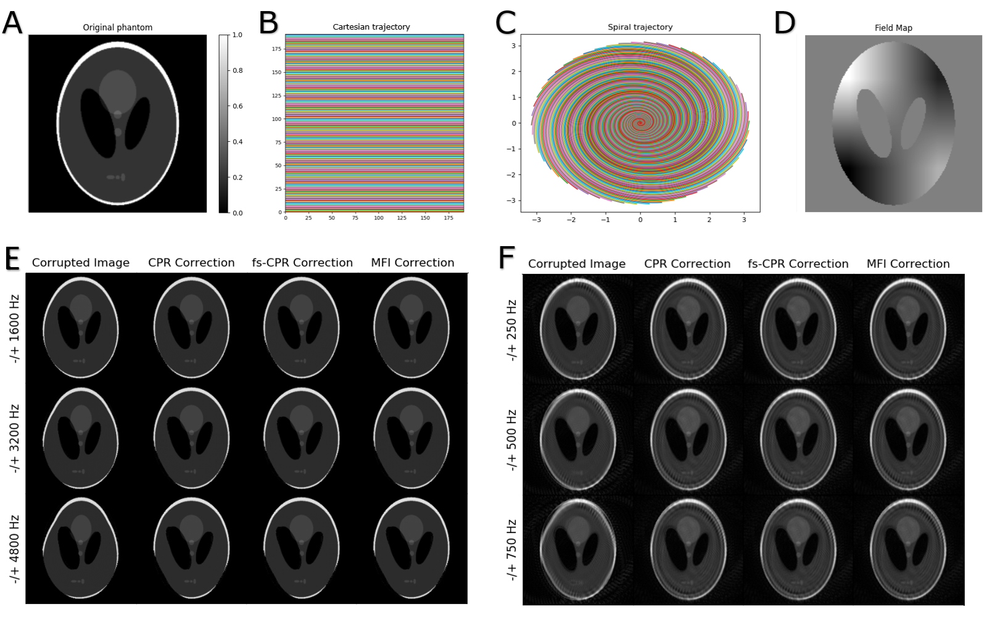
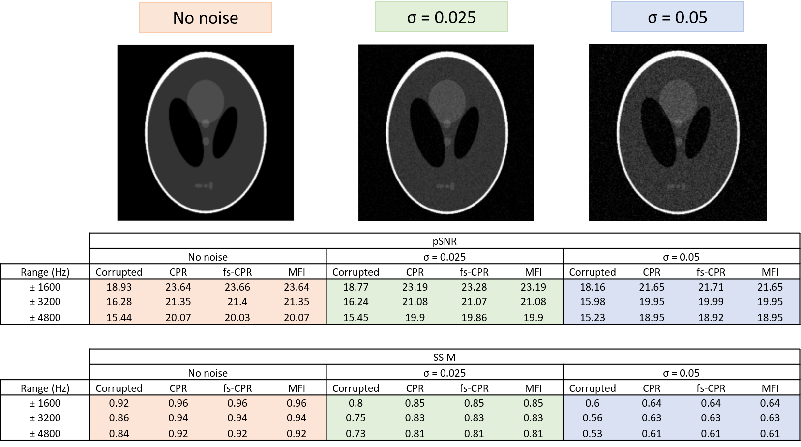

# Summary

`OCTOPUS` is a Python-based software for correction of off-resonance
artifacts in Magnetic Resonance (MR) images. It implements three different
methods for correction of both Cartesian and non-Cartesian data: Conjugate Phase Reconstruction (CPR), 
frequency-segmented CPR and Multi-Frequency Interpolation(MFI). `OCTOPUS` is easy to integrate into other two-dimensional reconstruction pipelines, which makes the tool highly flexible 
and customizable.

# Statement of need

Off-resonance is an MR artifact which can be produced by for instance field inhomogeneities, differences in tissue 
susceptibilities and chemical shift [@Noll1991]. These phenomena can cause the phase of off-resonant spins to accumulate along the
read-out direction, which can turn into blurring, geometrical distortion
and degradation in the reconstructed image [@LukPat2001]. Images
acquired using long readout trajectories and/or at high fields where the
field homogeneity is lower, are more prone to this problem. However,
such acquisition scenarios also deliver desirable properties, such as
short scanning times, gradient efficiency, motion tolerance and better
signal-to-noise ratio [@Chen2008].

Multiple successful off-resonance correction methods have been reported
by the literature [@Schomberg1999]. Most of them are based on Conjugate
Phase Reconstruction (CPR), a method which counteracts the accumulated
phase by demodulating k-space data with its conjugate [@Maeda1988]. From
the original CPR, faster and more efficient implementations were
developed, such as frequency-segmented CPR [@Noll1992] and
Multi-Frequency Interpolation (MFI) [@Man1997]. Frequency-segmented CPR reconstructs 
the corrected image by combining the pixels of L base images according to each pixel value on a field map. Each base image corresponds to the data demodulated at a fixed frequency, with 
the frequency values for each base image equally spaced within the field map frequency range.
MFI  works in a similar way as frequency-segmented CPR, with main differences being that it 
requires a smaller number of base images (L) and that these images are added together into the corrected image using a set of
linear coefficients derived from the field map. 

One can find limited off-resonance correction capabilities within
existing packages. Examples are: SPIRiT [@Lustig2010], a MATLAB-based
approach for auto-calibrated parallel imaging reconstruction; Ostenson's
MFI implementation for Magnetic Resonance Fingerprinting (MRF)
[@Ostenson2017]; FUGUE, a tool for Echo-Planar Imaging (EPI) distortion
correction part of the FSL library [@Jenkinson2012]; and the MIRT
toolbox, a MATLAB-based MRI reconstruction package that offers field
inhomogeneity correction using iterative reconstruction
methods [@Sutton2003; @Fessler2005]. Nylund's thesis [@Nylund2014] also
contains source MATLAB code for fs-CPR and MFI correction of spiral
images.

All of the mentioned implementations are highly specific, defined for a
particular k-space trajectory, application and/or include a single
correction method. SPIRiT is devoted to correct data acquired using 
parallel imaging methods, Ostenson's package only corrects MRF spiral data and implements 
only one correction method and FUGUE corrects distortion solely on EPI images. These limitations typically lead researchers to
adapt their data in an attempt to fit it into the available pipelines
or to write their own version of the methods. Either approach results in
a significant investment of time and effort and can generate isolated
implementations and inconsistent results. Furthermore, most of the
available packages are also MATLAB-based, which unlike Python, requires users to pay a license fee.

`OCTOPUS` is aimed at filling this gap in MR off-resonance correction packages. It provides
Python open-source code for three fundamental methods (CPR, fs-CPR and
MFI). The implementation is independent of the application and the image
acquisition scheme, easing its integration into any reconstruction
pipeline. `OCTOPUS` can also run in the browser through Google Colab, a freely hosted jupyter notebook environment that allows to execute Python code in the browser.
Given this feature, `OCTOPUS` is the first zero-footprint off-resonance
correction software, meaning it doesn't necessarily require software download, installation or configuration in the user's local machine.

# Functionality and limitations
`OCTOPUS` is aimed at MR researchers working with long-readout or field-inhomogeneity sensitive k-space trajectories or 
MR acquisition methods. A short demo is provided in the next section. `OCTOPUS` corrects or reduces geometric distortion and/or blurring present in the images due to off-resonance effects by 
leveraging other Python libraries, specifically NumPy [@2020NumPy], SciPy [@2020SciPy], scikit-image [@scikit-image], 
NiBabel[@Nibabel], Matplotlib [@Matplotlib], OpenCV [@itseez2015opencv], Pydicom [@darcy_mason_2020_3891702], and PyNUFFT[@pynufft]. 
The expected output is an image with recovered, sharper edges and undistorted shape.

Also, `OCTOPUS` corrects off-resonance independently of the trajectory used to acquire the data being Cartesian or non-Cartesian. 
The input of the correction methods could be either image or raw data, although using raw data is more efficient
and may avoid trajectory-dependent artifacts in the case of non-cartesian data.

At the current stage, the software limitations include: correction restricted to data two-dimensionally acquired in the absence of 
acceleration techniques; long correction times for large datasets and degraded correction quality in the presence of highly-inhomogeneous
fields. Additionally, the tool has been only tested on Cartesian and spiral data.

# Short demo
To illustrate the usage of the package we performed in silico numerical
simulations using a Cartesian trajectory, a spiral trajectory and a
simulated field map. For these experiments we used a Shepp-Logan head phantom, widely used
to test reconstruction algorithms [@Gonzalez2001].  The steps were:

1. Forward model simulation of off-resonance effect on a 192x192
   Shepp-Logan phantom (Figure 1.A).

   + Using a Cartesian trajectory (Figure 1.B) and a simulated field map
     (Figure 1.D) with frequency ranges of -/+ 1600, -/+3200 and -/+4800
     Hz.

   + Using a spiral trajectory (Figure 1.C) and a simulated field map
     (Figure 1.D) with frequency ranges of -/+ 250, -/+ 500 and -/+ 750
     Hz.

2. Correction of the results of the forward model (Figure 1.E and Figure
   1.F, first column) with CPR, fs-CPR and MFI (Figure 1.E and Figure
   1.F, second-fourth columns).

In both sets of experiments, 'OCTOPUS' has successfully corrected the
off-resonance induced blurring and/or geometrical distortion. Note that
spiral and reconstruction-related artifacts are still present in the
spiral simulated images.

To test the effect of noise on the correction performance we introduced different levels of noise and measured the peak signal-to-noise ratio (pSNR) and Structural Similarity Index (SSIM).

As expected, pSNR and SSIM are reduced as the off-resonance range widens and the noise level in the original image increases. Nevertheless, in all cases, the three implemented methods improve the metrics with respect to the off-resonance corrupted image.

# Acknowledgements

This study was funded (in part) by the 'MR Technology Development Grant'
and the 'Seed Grant Program for MR Studies' of the Zuckerman Mind Brain
Behavior Institute at Columbia University (PI: Geethanath) and the 'Fast
Functional MRI with sparse sampling and model-based reconstruction' of
the National Institute of Biomedical Imaging and Bioengineering (PI:
Fessler and, supplement, sub-award to Geethanath).

# References

