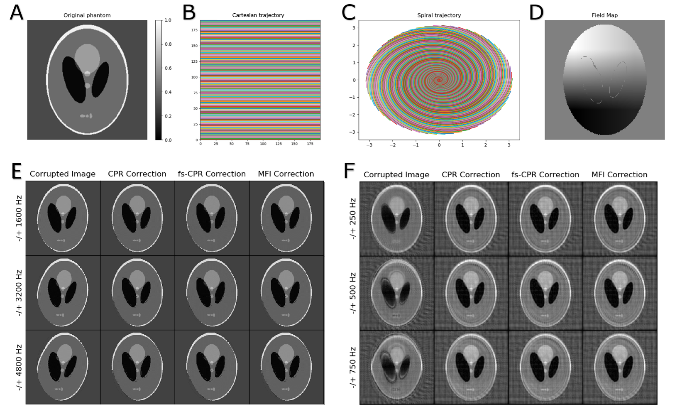

# Summary
# Statement of need

 Off-resonance is a type of MR artifact which source can vary from field inhomogeneities, to differences in tissue susceptibilities and chemical shift [@Noll1991]. These phenomena can cause the phase of off-resonant (not at the resonant or Larmor frequency) spins to accumulate along the read-out direction, which can turn into blurring, geometrical distortion and degradation in the reconstructed image [@LukPat2001]. Images acquired using long readout trajectories and/or at high fields where the field homogeneity is lower, are more prone to this problem. However, such an acquisition scenario also brings other desirable propreties, such as short scanning times, gradient efficiency, motion tolerance and better signal-to-noise ratio [@Chen2008].

Multiple successful off-resonance correction techniques have been reported by the literature [@Schomberg1999]. Most of them are based on Conjugate Phase Reconstruction (CPR), a technique which aims at counteracting the accumulated phase by demodulating k-space data with its conjugate [@Maeda1988]. From the original CPR, faster and more efficient implementations were developed, such as frequency-segmented CPR [@Noll1992] and Multi-Frequency Interpolation (MFI) [@Man1997].

One can find some off-resonance correction capabilities within packages that have other specific aims. Examples are SPIRiT [@Lustig2010], a MATLAB-based approach for autocallibrated parallel imaging reconstruction; Ostenson's MFI implementation for Magnetic Resonance Fingerprinting (MRF) [@Ostenson2017]; and FUGUE, a tool for Echo-Planar Imaging (EPI) distortion correction part of the FSL library [@Jenkinson2012]. In the appendix of Nylund's thesis [@Nylund2014] we also found source MATLAB code for fs-CPR and MFI correction of spiral images.

These implementations typically lead researchers to try to fit their data into the available pipelines or to write their own implementation of the methods. Both approaches result in a significant investment of time and efforts and can generate 'bubble' implementations and inconsistent results.

`OCTOPUS` is aimed at filling this gap in MR off-resonance correction packages by providing Python open-source code that is independent of the application and the image acquisition scheme.

# Short demo

To illustrate the usage of the package we performed in silico numerical simulations using a Cartesian trajectory, a spiral trajectory and a simulated field map. The procedure steps were:
1. Forward model simulation of off-resonance effect on a 192x192 Shepp-Logan phantom (Figure 1.A).
   - Using a Cartesian trajectory (Figure 1.B) and a simulated field map (Figure 1.D) with frequency ranges of -/+ 1600, -/+3200 and -/+4800 Hz.
   - Using a spiral trajectory (Figure 1.C) and a simulated field map (Figure 1.D) with frequency ranges of -/+ 250, -/+ 500 and -/+ 750 Hz.
2. Correction of the results of the forward model (Figure 1.E and Figure 1.F, first column) with CPR, fs-CPR and MFI (Figure 1.E and Figure 1.F, second-fourth columns).

In both sets of experiments, 'OCTOPUS' has successfully corrected the off-resonance induced blurring and/or geometrical distortion. Note that spiral and reconstruction-related artifacts are still present in the spiral simulated images.

# Acknowledgements

This study was funded (in part) by the 'MR Technology Development Grant' and the 'Seed Grant Program for MR Studies'
of the Zuckerman Mind Brain Behavior Institute at Columbia University (PI: Geethanath) and the 'Fast Functional MRI with sparse sampling and model-based reconstruction' of the National Institute of Biomedical Imaging and Bioengineering (PI: Fessler and, supplement, subaward to  Geethanath).

# References
