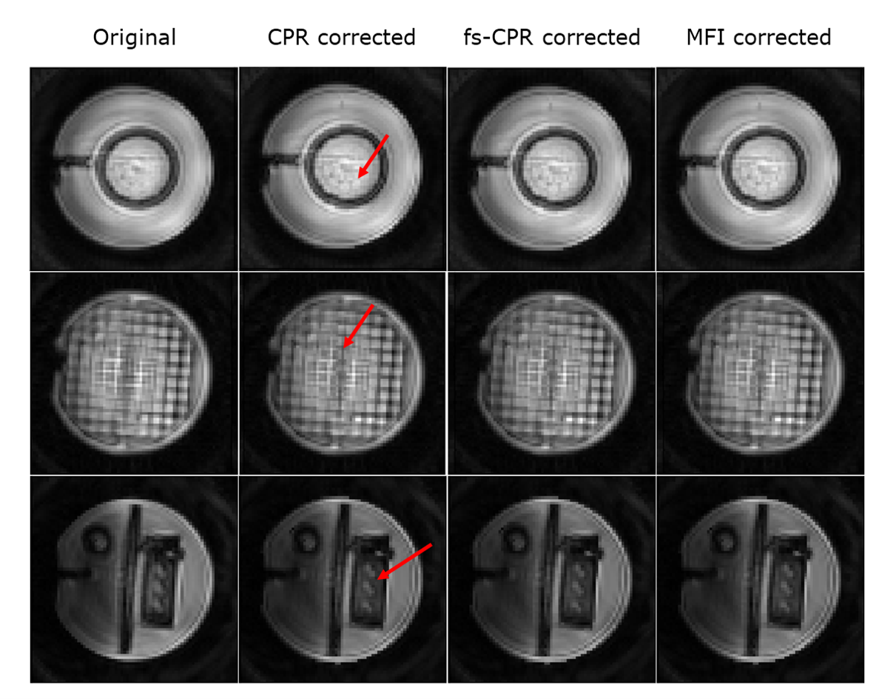

# Summary

`OCTOPUS` is a Python-based software for correction of off-resonance
artifacts in Magnetic Resonance (MR) images. It implements three different
methods for correction of both Cartesian and non-Cartesian data: Conjugate Phase Reconstruction (CPR), 
frequency-segmented CPR and Multi-Frequency Interpolation(MFI). `OCTOPUS` is easy to integrate into other two and three-dimensional reconstruction pipelines, which makes the tool highly flexible 
and customizable.

# Statement of need

Off-resonance is an MR artifact which occurs due to field inhomogeneities, differences in tissue 
susceptibilities and chemical shift [@Noll1991]. These phenomena can cause the phase of off-resonant spins to accumulate along the
read-out direction, which can turn into blurring, geometrical distortion
and degradation in the reconstructed image [@LukPat2001]. Images
acquired using long readout trajectories and/or at high fields where the
field homogeneity is lower, are more prone to this problem. However,
such acquisition scenarios also deliver desirable properties, such as
short scanning times, gradient efficiency, motion tolerance and better
signal-to-noise ratio [@Chen2008].

Multiple successful off-resonance correction methods have been reported
by the literature [@Schomberg1999]. Most of them are based on Conjugate
Phase Reconstruction (CPR), a method which counteracts the accumulated
phase by demodulating k-space data with its conjugate [@Maeda1988]. From
the original CPR, faster and more efficient implementations were
developed, such as frequency-segmented CPR [@Noll1992] and
Multi-Frequency Interpolation (MFI) [@Man1997]. Frequency-segmented CPR reconstructs 
the corrected image by combining the pixels of "L" base images according to each pixel value on a field map. Each base image corresponds to the data demodulated at a fixed frequency, with 
the frequency values for each base image equally spaced within the field map frequency range.
MFI  works in a similar way as frequency-segmented CPR, with main differences being that it 
requires a smaller number of base images (L) and that these images are added together into the corrected image using a set of
linear coefficients derived from the field map. 

One can find optimised off-resonance correction capabilities within
existing packages. Examples are: SPIRiT [@Lustig2010], a MATLAB-based
approach for auto-calibrated parallel imaging reconstruction; Ostenson's
MFI implementation for Magnetic Resonance Fingerprinting (MRF)
[@Ostenson2017]; FUGUE, a tool for Echo-Planar Imaging (EPI) distortion
correction part of the FSL library [@Jenkinson2012]; and the MIRT
toolbox, a MATLAB-based MRI reconstruction package that offers field
inhomogeneity correction using iterative reconstruction
methods [@Sutton2003; @Fessler2005]. Nylund's thesis [@Nylund2014] also
contains source MATLAB code for fs-CPR and MFI correction of spiral
images.

All of the mentioned implementations are highly specific, defined for a
particular k-space trajectory, application and/or include a single
correction method. SPIRiT is devoted to correct data acquired using 
parallel imaging methods, Ostenson's package only corrects MRF spiral data and implements 
only one correction method and FUGUE corrects distortion solely on EPI images. These limitations typically lead researchers to
adapt their data in an attempt to fit it into the available pipelines
or to write their own version of the methods. Either approach results in
a significant investment of time and effort and can generate isolated
implementations and inconsistent results. Furthermore, most of the
available packages are also MATLAB-based, which unlike Python, requires users to pay a license fee.

`OCTOPUS` is aimed at filling this gap in MR off-resonance correction packages. It provides
Python open-source code for three fundamental methods (CPR, fs-CPR and
MFI). The implementation is independent of the application and the image
acquisition scheme, easing its integration into any reconstruction
pipeline. `OCTOPUS` can also run in the browser through Google Colab, a freely hosted jupyter notebook environment that allows to execute Python code in the browser.
Given this feature, `OCTOPUS` is the first zero-footprint off-resonance
correction software, meaning it doesn't necessarily require software download, installation or configuration in the user's local machine.

# Functionality and limitations
`OCTOPUS` is aimed at MR researchers working with long-readout or field-inhomogeneity sensitive k-space trajectories or 
MR acquisition methods. A short demo is provided in the next section. `OCTOPUS` corrects or reduces geometric distortion and/or blurring present in the images due to off-resonance effects by 
leveraging other Python libraries, specifically NumPy [@2020NumPy], SciPy [@2020SciPy], scikit-image [@scikit-image], 
NiBabel[@Nibabel], Matplotlib [@Matplotlib], OpenCV [@itseez2015opencv], Pydicom [@darcy_mason_2020_3891702], and PyNUFFT[@pynufft]. 
The expected output is an image with recovered, sharper edges and undistorted shape.

Also, `OCTOPUS` corrects off-resonance independently of the trajectory used to acquire the data being Cartesian or non-Cartesian. 
The input of the correction methods could be either image or raw data. However, using raw data as input is more efficient
and may avoid non Cartesian trajectory-dependent artifacts. `OCTOPUS` is also able to correct 3D multi-slice and multi-channel data by feeding it to the tool in a slice and channel-wise manner and then applying channel combination with the user's method of choice.

Presently, the software limitations include: correction restricted to data acquired in the absence of 
acceleration techniques; long correction times for large datasets and degraded correction quality in the presence of highly-inhomogeneous
fields. Additionally, the tool has been only tested on Cartesian, EPI and spiral data.

# Short demo
To illustrate the usage of the package we performed in silico numerical
simulations using a single-shot EPI trajectory, a single-shot spiral trajectory and a
simulated field map. For these experiments we used a Shepp-Logan head phantom, which simulates a section of the skull and is widely used
to test reconstruction algorithms [@Shepp1974]. Figure 1 shows all inputs and outputs of the experiment. The steps were:

1. Forward model simulation of off-resonance effect on a 128x128
   Shepp-Logan phantom and 256 mm2 FOV.

   + Using single-shot EPI and spiral trajectories. Figure 1 shows simplified versions of both trajectories for visualization purposes.

   + Using a  simulated field map based on a blurred version of the phantom image with frequency ranges of -/+ 100, -/+150 and -/+200 Hz.

2. Correction of the results of the forward model with CPR, fs-CPR and MFI .

In both experiments, 'OCTOPUS' has successfully corrected the
off-resonance induced blurring and/or geometrical distortion. Note how the EPI corrupted images show geometric distortion in the phase-encode direction while spiral corrupted images show blurred and distorted edges.

To test the effect of noise on the correction performance we introduced different levels of noise to a single-shot EPI trajectory-based simulation and measured the peak signal-to-noise ratio (pSNR) and Structural Similarity Index (SSIM). 

As expected, PSNR and SSIM are reduced as the off-resonance range widens and the noise level in the original image increases. Nevertheless, in all cases, the three implemented methods improve the metrics with respect to the off-resonance corrupted image.

Finally, to demonstrate the correction capabilities in 3D multi-slice and multi-channel data, we corrected phantom images of a Stack-of-Spirals acquisition with matrix size of 72x72, FOV=240 mm2 and 54 slices. The images were acquired on a Siemens 3T Prisma scanner using a 20-channel head coil. Figure 3 shows three representative slices and their off-resonance corrected versions. The regions of the images highlighted in red show improved image quality and enhaced edges.

# Acknowledgements

This study was funded (in part) by the 'MR Technology Development Grant'
and the 'Seed Grant Program for MR Studies' of the Zuckerman Mind Brain
Behavior Institute at Columbia University (PI: Geethanath) and the 'Fast
Functional MRI with sparse sampling and model-based reconstruction' of
the National Institute of Biomedical Imaging and Bioengineering (PI:
Fessler and, supplement, sub-award to Geethanath).

# References

